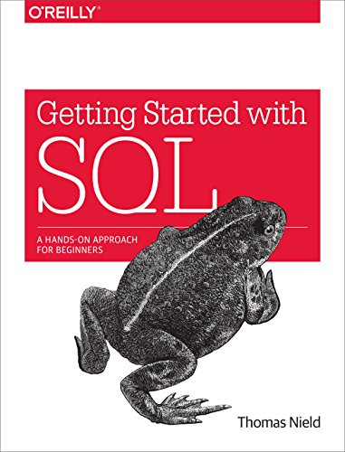
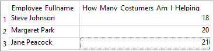
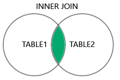

# LEARNING AND REVIEWING :books:

As a Data Science student, my first goal is to understand SQL completely. To achieve this, I am reading SQL books. The first one is *"Learning SQL: Master SQL Fundamentals"*. I already know most of the content, but it's important to reinforme some commands, clauses and statements in the language.

I am gonna write below the most interesting and useful aspects of each chapter and, whenever I feel inspired, I am going to create something to practice the new knowledge.

Since the book does not include exercises to practice, I download a ready to use database from [SQLite Tutorial](https://www.sqlitetutorial.net/sqlite-sample-database/). I named as "Artist_Employee", but the original name is "Chinook". The SQL file containing the questions and answers is in the folder "Artists_Employee" above.

## Chapter 4: `SELECT` COMMAND

Three year ago, at my first graduation, the `SELECT` command was the first command I learned during the subject "Databases I". Therefore, this module was easy and familiar for me. Despite that, there were some topicts I've never heard about, such as text concatenation. This topic is about how you can concatenate informations from diferent colums into one and show them in an expecific way for your user. Let's see an example:

If I want to concatenate 2 colums: `CITY` and `STATE` from a table called `USERS` to show it as an address, for example, I could use the symbol bar "|":

`SELECT NAME, CITY || ',' || STATE AS LOCATION FROM USERS`

In the example above, this new column, which concatenates the two other columns will be named as "*location*", but won't be created as a real column in the table. It's just to present information.

For this chapter, the author used the database *Weather_Stations*.

## Chapter 5: `WHERE` COMMAND

For this chapter, the author used the database *Rexon_Metals*.

This chapter is full of useful comands and symbols. The most intersting for me was the '%' and '_', linked with the expression `LIKE` string by characters to filter. For example: if I just want the report codes from the column `report_code` of the table `station_data` that starts with 'A' followed by any character.

`SELECT * FROM STATION_DATA  WHERE REPORT_code like 'A%'`

As you have been noticing, I like to manipulate strings.

## Chapter 6: `GROUP BY` AND `ORDER BY` COMMANDS

For this chapter, the author used the database *Weather_Stations*.

This chapter has a lot of usefull information that I have never learned before and introduced more than 10 new commands, including aggregate functions and operators llike `DESC` and `DISTINCT`.

Even though there are a lot of information, I am going to start by the command `ORDER BY`, because this was the one I struggled to undertand. It's used to order a set in ascending or decending order (for this last one, you will need to use `DESC` after the column's name).

Using the database "Chinook" from SQLite website, I tried to create questions to answer myself. I am going to write it below, followed by my answer. (More questions in the file)

1.  Is *Purchased AAC media* more used in *Pop* or *Drama* genre?

- Answer: The use of the media is equal for both genres.

SQL Query used:

`select genres.Name, COUNT(media_types.Name) AS Media_Purchased_AAC_Audio_File FROM genres, media_types 
where media_types.Name='Purchased AAC audio file' 
AND genres.Name IN ('Pop', 'Drama')
GROUP BY genres.Name;`

As you can see, I needed to learn more contents than I had been leaning until now. But it was really helpful to see beyond the book's content.One important thing I learned from this exercise is that `COUNT()` only works if used with `GROUP BY`.

2.  Show the employees and how many customers they are helping in decending order.

- Answer: code.

`select employees.FirstName || ' ' || employees.LastName AS EMPLOYEE_FULLNAME, `
`COUNT(customers.SupportRepId) AS How_Many_Costumers_Am_I_Helping `
`FROM employees, customers `
`WHERE employees.EmployeeId = customers.SupportRepId `
`GROUP BY employees.FirstName `
`ORDER BY employees.FirstName DESC; `

Result table:

From this question, I learned the importance of follow the SQL commands in the correct sequen

## Chapter 7: `CASE` STATEMENTS

For this chapter, the author used the database *Weather_Stations*.

Since I have a good knowledge of programming, learn about this topic was easier. CASE statement can filter information, just like `WHERE` command does, but it allow us to be more specific and  make more complex queries. 

The most interesting topic about this chapter was "Case Zero/Null", which shows that we can put a whole `CASE` statement inside an agregated function:

`SELECT month,
AVG(CASE WHEN (RAIN OR HAIL) THEN temperature ELSE 0 END) as avg_precipitation_temp,
AVG(CASE WHEN NOT (RAIN OR HAIL) THEN temperature ELSE 0 END) as non_avg_precipitation_temp
FROM station_data
WHERE year > 2000
GROUP BY month`

In the query above, the aim is to get the average of temperature when it rains or hails and when it does not rain or hail after the year 2000.

## Chapter 8: `JOIN` CLAUSE

This chapter explain **three types** of JOIN clause: INNER JOIN, LEFT JOIN and RIGHT (OUTER) JOIN. Let's start with INNER JOIN. The images illustrating the JOINS are from [W3Schools website](https://www.w3schools.com/sql/sql_join.asp).

### 1. `INNER JOIN`

`INNER JOIN` is used to return records that have commom columns in both tables.

This type is used with `FROM` statement and just returns records that exists in both tables. In addiction: INNER JOIN does not allow null vales. So, if you want to see NULL values you should use `LEFT JOIN`.

EXAMPLE: shows all customers and your invoices. This two tables are related by the field `CustomerId`.

`SELECT`
`CUSTOMERS.CustomerId,`
`FirstName AS CUSTOMER_NAME,`
`InvoiceId AS ID_ORDER,`
`Total,`
`InvoiceDate AS INITIAL_DATE,`
`COUNT(*) as NUMBER_ORDERS`
`FROM CUSTOMERS INNER JOIN INVOICES ON CUSTOMERS.CustomerId = INVOICES.CustomerId`
`GROUP BY CUSTOMERS.CustomerId;`

### 2. `LEFT JOIN`

`LEFT JOIN` is used to return all records from the left table and the records that mached records from the right table. The author recommends to use always `LEFT JOIN` with the table with "all records" on the LEFT of the clause because `RIGHT JOIN` is barely used and must be avoided.

### 3. `RIGHT JOIN` and `OUTER JOIN`

Both clauses are barely used and SQLite does not support them. Because of that, the book does not show examples of this two clauses.

## Chapter 9: DATABASE DESIGN

Throught this chapter, we are going to build our own database, rather than just manipulating data using queries.

This database was created by the author to manage a fictional conference called **SurgeTech**. In this fictional scenario, you were tasked by the manager to build a database to handle the attendees, companies, rooms, presentations and attendancees of each presentation. The database schema (Made using [Miro](https://miro.com/app/dashboard/)) and he author's suggested tables are shown below:

| COMPANY    | 
| -------- | 
| COMPANY_ID |                      
| NAME | 
| DESCRIPTION    | 
| PRIMARY_CONTACT_ATENDEE_ID |

| ROOM    | 
| -------- | 
| ROOM_ID | 
| FLOOR_NUMBER | 
| SEAT_CAPACITY    | 

| ATENDEE    | 
| -------- | 
| ATENDEE_ID | 
| FIRST_NAME | 
| LAST_NAME   | 
| PHONE |
| EMAIL |
| VIP |

| PRESENTATION    | 
| -------- | 
| PRESENTAION_ID | 
| BOOKED_COMPANY_ID | 
| BOOKED_ROOM_ID   | 
| START_TIME |
| END_TIME |

| PRESENTATION_ATTENDANCE    | 
| -------- | 
| TICKET_ID | 
| PRESENTATION_ID | 
| ATENDEE_ID    | 

These tables and the database were created in SQLite using the interface, as the book taught. So now, the database browser has a database named **SurgeTech_Conference**.
