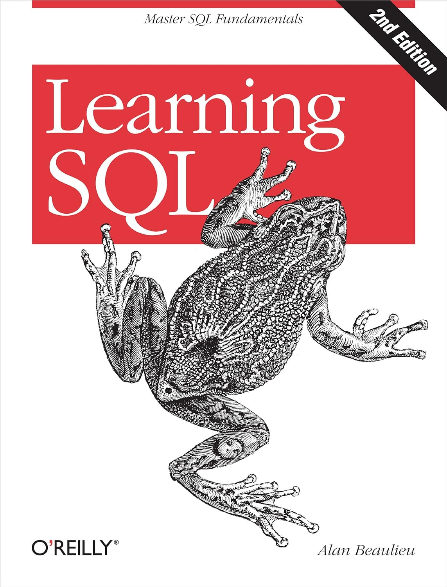

# LEARNING AND REVIEWING :books:

As a Data Science student, my first goal is to understand SQL completely. To fulfill this goal, I am reading SQL books. The first one is *"Learning SQL: Master SQL Fundamentals"*. I already know most of the contents, but it's important to reinforme some comands and aspects of the language.

I gonna write below the most interesting aspects and useful aspects of each chapter and, whenever I feel inspired, I am going to create something new to practice the new knowledge.

## Chapter 4: `SELECT` COMMAND

## Chapter 5: `WHERE` COMMAND

## Chapter 6: `GROUP BY` AND `ORDER BY` COMMANDS